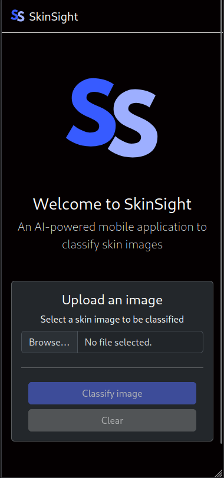
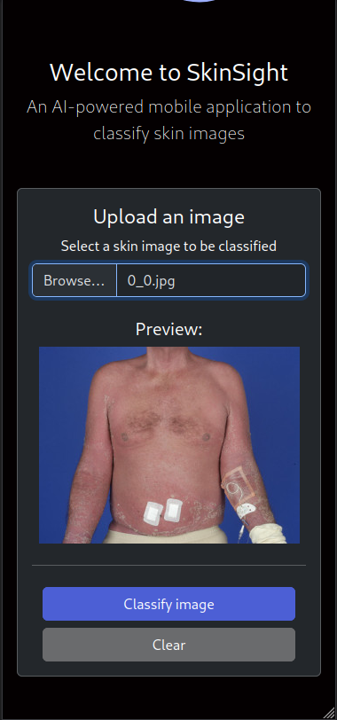
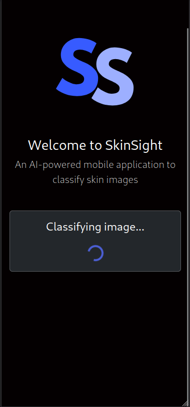
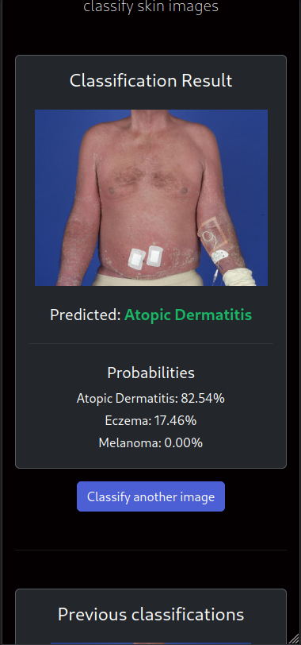
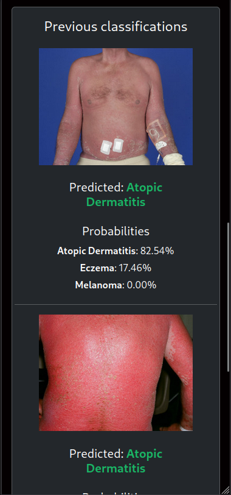

# 🌟 SkinSight

Welcome to the **SkinSight** repository! This project is dedicated to developing a mobile application that allows users to take pictures of their skin and receive predictions regarding the likelihood of various skin diseases.

This repository includes:

- 📱 A **React** frontend
- 🚀 A **FastAPI** backend
- 🧠 A **Keras-based** model for skin disease prediction

---

## 📸 Demo

The following screenshots illustrate the process of uploading an image, sending it to the backend for processing, and receiving classification results. Additionally, once an image is classified, you can view the history of previous classification results.

<div style="display: flex; justify-content:center; text-align:center">
  <div style="width: 20%">
    
  </div>
  <div style="width: 20%">
    
  </div>
  <div style="width: 20%">
    
  </div>
  <div style="width: 20%">
    
  </div>
  <div style="width: 20%">
    
  </div>
</div>

You can also watch a video demonstration of the application:

<div style="display:flex; justify-content: center; text-align: center;">
    <video  width="50%" controls>
        <source src="screenshots/demo_skinsight.mp4" type="video/mp4">
    Your browser does not support the video tag.
    </video>
</div>

---

## 🧑‍⚕️ Model

The trained model is a **Convolutional Neural Network (CNN)** trained on the [Skin Diseases Image Dataset](https://www.kaggle.com/datasets/ismailpromus/skin-diseases-image-dataset). While the original dataset contains 10 classes, we have simplified it to focus on **three key conditions**:

✅ Atopic Dermatitis  
✅ Eczema  
✅ Melanoma

You can download the reduced dataset from [here](https://nubeusc-my.sharepoint.com/:f:/g/personal/eliseo_pita_rai_usc_es/EtOuVOWFrtJNr2tE7mrjTiwBPLDMcMdEqCAUjqjA5NsG0w?e=INqmDH). Extract and place the `raw_data` folder inside `model/data`. Each class has its corresponding folder.

### 🏗 Model Architecture

- **4** Convolutional layers
- **2** Dense layers
- Trained for **30 epochs** with **batch size 32**
- **EarlyStopping** with patience of **10 epochs**
- Achieved **88.60% accuracy**

### ▶️ Running the Model

To set up and run the model, create a Conda environment with:

```bash
conda env create -f environment.yaml
```

Then, execute:

```bash
python model.py
```

### 📂 File Structure

Inside the `model` folder, you'll find:

- `model.py` - Defines the CNN architecture and training
- `dataloader.py` - Handles data loading
- `evaluate_model.ipynb` - Evaluates model performance and preprocessing steps
- `environment.yaml` - Specifies environment dependencies

💡 **Note:** If you don't have a GPU, training can be slow. You can download a pre-trained model from [here](https://nubeusc-my.sharepoint.com/:f:/g/personal/anton_gomez_lopez_rai_usc_es/EosNaX9dhM9Dj3kB3PgrS8kB5mfj3I0QfV5bgoM7rcyopA?e=fehaKq) and place it in `model/`. Then, run `evaluate_model.ipynb` to explore results.

---

## ⚙️ Backend

The backend is built using **FastAPI** and includes three endpoints:

- `/` - **GET**: Returns a welcome message.
- `/classify-image` - **POST**: Receives an image and returns a classification.
- `/previous-classifications` - **GET**: Retrieves past predictions.

### ▶️ Running the Backend

Set up the environment:

```bash
conda env create -f environment.yaml
```

Run the backend:

```bash
uvicorn main:app --reload
```

This starts the backend on **localhost:8000**. Access the API documentation at:  
🔗 `http://localhost:8000/docs`

### 📂 File Structure

Inside the `backend` folder:

- `main.py` - Defines the API endpoints
- `model.py` - Loads and preprocesses the model for predictions
- `environment.yaml` - Defines backend dependencies

To run the backend, place the trained model in `backend/models/`. Download it from [here](https://nubeusc-my.sharepoint.com/:f:/g/personal/anton_gomez_lopez_rai_usc_es/EosNaX9dhM9Dj3kB3PgrS8kB5mfj3I0QfV5bgoM7rcyopA?e=fehaKq) if needed.

---

## 🎨 Frontend

The frontend is built with **React** and **Bootstrap**. To run it:

```bash
cd frontend
npm install
npm run dev
```

By default, the frontend runs on **localhost:5173**. Access it here:  
🔗 `http://localhost:5173`

⚠️ **Note:** Ensure you have `npm` installed to run the frontend.

---

### 🌟 Contributors

- [Antón Gómez López](https://github.com/antongomez)
- [Eliseo Pita Vilariño](https://github.com/elipitav)
- [Pouria Alvarzandi](https://github.com/pouriazandi)

### 📝 License

This project is licensed under the **MIT License**. You can find more information in the `LICENSE` file.
